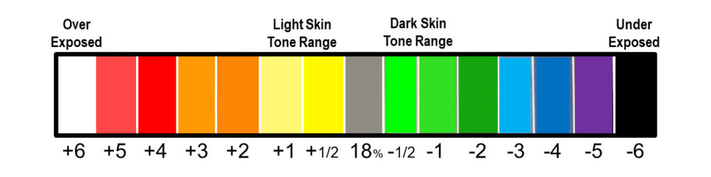
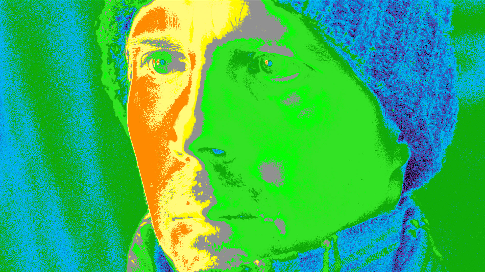
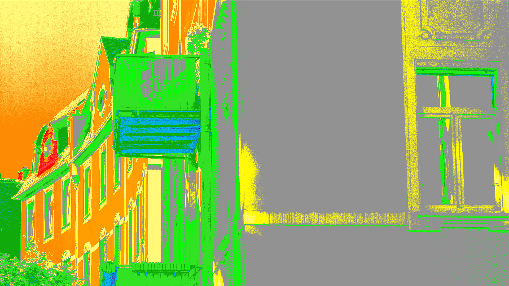
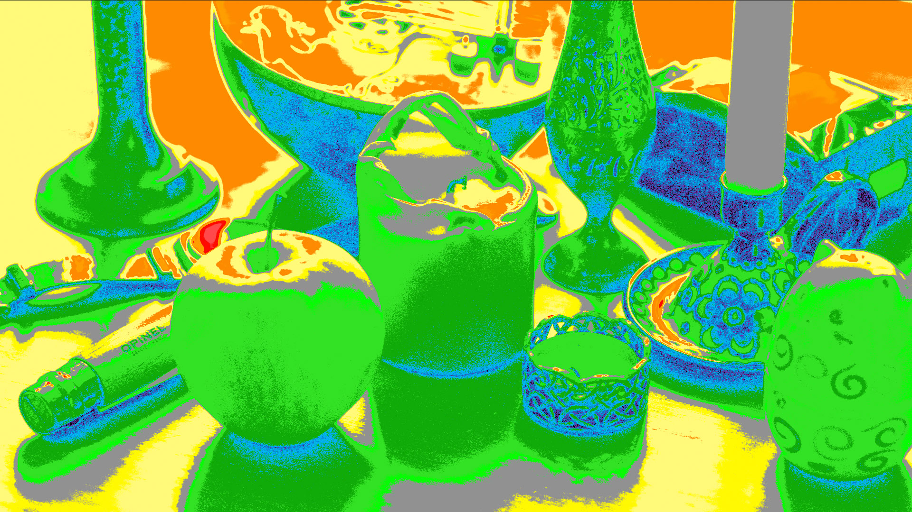

# EL-Zone
A collection of Fusion files to create LUTs for monitoring in the EL Zone system.

The EL Zone system is an exposure tool developed by Cinematographer Ed Lachman, ASC.

The color gradient shows the exposure steps over and under 18% grey.

## Usage
The LUT files are to be used with the Sony F35 and an external monitor with LUT support.

The LUA Fusion file contains a group that creates the gradient.
It has two UI sliders for ISO and Base ISO.

The group can be adopted easily to other Log signals by changing the Color Space transfomr inside the group.

## Examples

